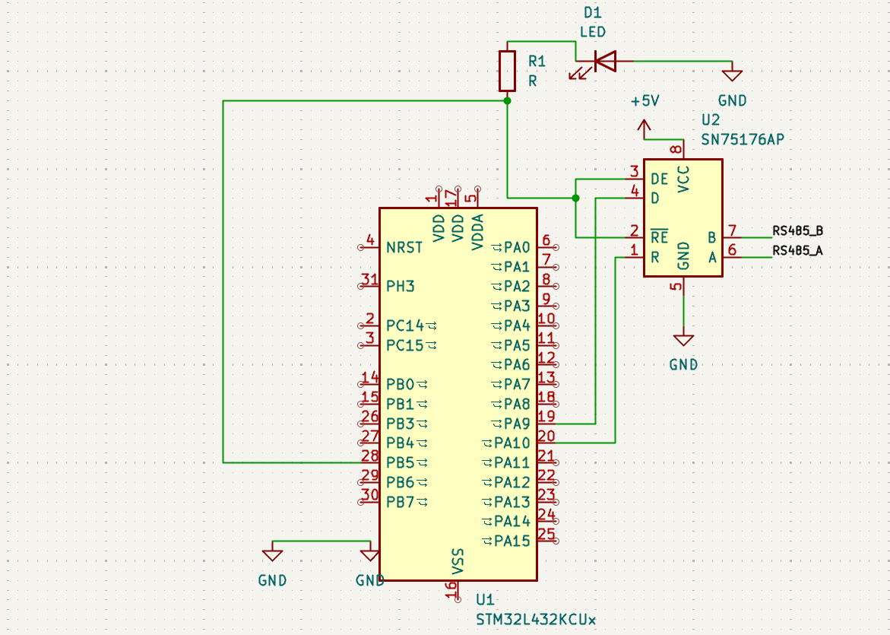

# WhazzUp – RS485 Communication using STM32 (HAL)

## Overview
This project demonstrates communication between two STM32 boards using UART extended with RS485. The system uses the SN75176 transceiver to convert UART signals into differential RS485 signals for more reliable communication.

The final implementation was completed using the **STM32 HAL (Hardware Abstraction Layer)**.

---

## Project Aim
To design and implement communication between two STM32 boards using UART and RS485 with HAL-based peripheral configuration.

---

## Objectives
- To configure UART communication on STM32 using HAL
- To interface the SN75176 RS485 transceiver
- To transmit data reliably between two embedded boards
- To control transmit and receive mode using GPIO
- To verify operation using serial monitor and LED indication

---

## Hardware Used
- STM32L432KC
- SN75176 / SN75176AP RS485 transceiver
- Breadboard
- Jumper wires
- Twisted pair wire for RS485 A/B lines
- LED
- Resistor
- USB cable

---

## Circuit Connections

| STM32 Pin | RS485 Pin | Function |
|----------|----------|----------|
| PA9 | DI | USART1 transmit to RS485 |
| PA10 | RO | USART1 receive from RS485 |
| PB5 | DE + RE̅ | RS485 direction control |
| PA2 | USART2 TX | PC serial monitor |
| PA3 | USART2 RX | PC serial monitor |
| +5V | VCC | RS485 transceiver supply |
| GND | GND | Common ground |

---

## LED Indicator
PB5 is also connected to an LED through a resistor.

`PB5 -> Resistor -> LED -> GND`

This LED gives a visual indication when the transceiver enters **transmit mode**.

---

## RS485 Bus
The communication channel uses two wires:

- A -> RS485_A
- B -> RS485_B

These two lines form the RS485 differential bus.

---

## Working Principle
The STM32 uses **USART1** to generate serial data.  
The SN75176 transceiver converts the UART signal into RS485 differential signals and sends them through the A and B lines.

PB5 is used to control the direction of communication:

- **PB5 HIGH** -> transmit mode
- **PB5 LOW** -> receive mode

At the same time, **USART2** is used to display debug messages on the PC serial monitor.

---

## Software Approach
The final working software was implemented using the **STM32 HAL library**.

The following HAL functions were used:
- `HAL_Init()`
- `HAL_UART_Init()`
- `HAL_UART_Transmit()`
- `HAL_GPIO_WritePin()`

This made the program easier to read, easier to maintain, and closer to a standard embedded software development approach.

---

## HAL Features Used
- HAL-based GPIO initialization
- HAL-based USART1 initialization for RS485
- HAL-based USART2 initialization for PC terminal
- HAL-based transmit function for sending strings
- HAL-based GPIO control for switching DE and RE̅

---

## Main Program Behaviour
The transmitter board repeatedly sends the message:

`Hello from Person 1`

At the same time, the board prints status messages to the serial monitor such as:

- `=== PERSON 1 TRANSMITTER READY ===`
- `Sending: Hello from Person 1`

This confirms that the system is transmitting correctly.

---

## Source Code
The main source file is located in:

`src/main.c`

### Main Features of the Code
- USART1 communication for RS485
- USART2 communication for PC terminal
- PB5 control for DE and RE̅
- Repeated message transmission
- HAL-based peripheral setup

---

## Testing and Debugging
The system was tested using the following methods:

- Serial monitor output at 9600 baud
- LED indication for transmit mode
- Manual hardware connection checks
- Reset button testing
- Verification of UART communication through terminal messages

### Debugging Observations
- The serial monitor showed the expected status messages
- The LED indicated that PB5 was switching correctly
- The RS485 communication line transmitted data correctly

---


## 📷 Circuit Diagram


## Block daigram


## 💻 Source Code
The main program is available in:
https://github.com/jhansikotla7004/whazzup-rs485-stm32/blob/main/src/main.c
### Key Features:
- UART communication using USART1 and USART2  
- RS485 communication using SN75176  
- Direction control using PB5 (DE/RE)   
## Demo Video
https://youtu.be/tJVlsnRzWfQ?si=JAhtyjtGYYxxjAPA
## Author
KOTLA JHANSI LAKSHMI


## Results
The system successfully transmitted the message over the RS485 bus.

Observed terminal output:

```text
=== PERSON 1 TRANSMITTER READY ===
Sending: Hello from Person 1
Sending: Hello from Person 1
Sending: Hello from Person 1


